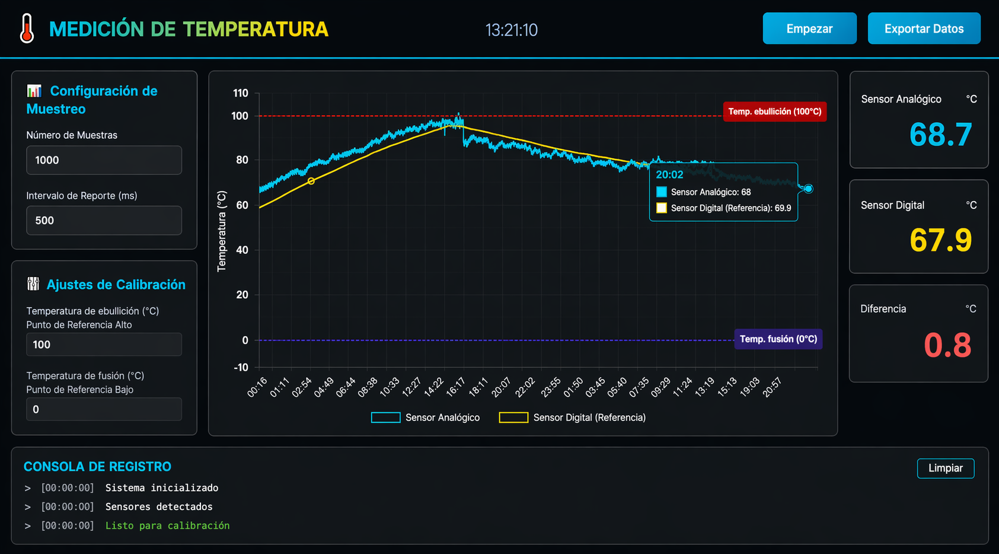
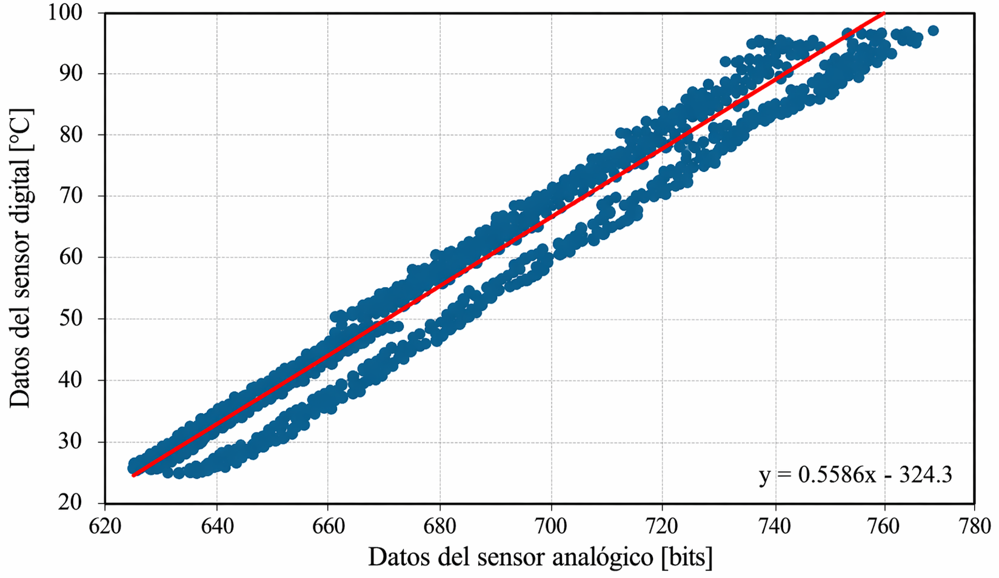

# 🌡️ Interfaz de Medición de Temperatura en Tiempo Real

Interfaz web para la adquisición, visualización y almacenamiento de datos de temperatura provenientes de dos sensores —uno analógico (LM335) y uno digital (DS18B20)— conectados a un Arduino UNO. Desarrollada como proyecto final de la materia de **Instrumentación y Control** en la Facultad de Ingeniería de la UADY (enero–mayo 2025).

> **Nota:** Esta interfaz fue desarrollada de forma independiente por **Gabriela Yasmin Vidales Ayala** como parte del proyecto de calibración comparativa de sensores de temperatura.

---

## 🖼️ Vista previa

**Interfaz en funcionamiento** — captura tomada a los 45 minutos del experimento, durante la etapa de enfriamiento tras superar el punto de ebullición:



**Modelo de calibración** — relación lineal entre los bits crudos del sensor analógico LM335 y la temperatura registrada por el DS18B20:



---

## 📋 Descripción

La aplicación corre un servidor Flask que escucha el puerto serial del Arduino y expone una API REST consumida por el frontend (HTML + CSS + JavaScript). Los datos se grafican en tiempo real mediante **Chart.js** y se exportan automáticamente a un archivo CSV al iniciar la sesión.

El experimento para el que fue diseñada consistió en:
1. Colocar ambos sensores en agua con hielo (temperatura mínima ≈ 1.7 °C).
2. Calentar el agua hasta el punto de ebullición.
3. Dejar enfriar hasta temperatura ambiente (≈ 25–33 °C).
4. Registrar todo el proceso durante ~4 horas 44 minutos, generando más de 60 000 lecturas.

---

## ✨ Características

- Visualización en tiempo real de las lecturas de ambos sensores.
- Líneas de referencia configurables para los puntos de fusión (0 °C) y ebullición (100 °C).
- Consola de eventos integrada con registro de errores, conexiones y cambios de estado.
- Exportación automática a CSV con timestamp, valores analógicos (°C y bits crudos), valor digital (°C) y diferencia entre sensores.
- Detección automática del puerto Arduino (compatible con CH340, USB Serial y Arduino oficial).
- Controles de conexión y desconexión sin necesidad de reiniciar el servidor.
- Soporte para Docker y despliegue en Render.

---

## 🗂️ Estructura del proyecto

```
Interfaz_Medicion/
├── app.py                                      # Servidor Flask + lectura serial + escritura CSV
├── index.html                                  # Estructura del frontend
├── styles.css                                  # Estilos de la interfaz
├── script.js                                   # Lógica del frontend, Chart.js y polling a la API
├── requirements.txt                            # Dependencias Python
├── Dockerfile                                  # Imagen Docker lista para producción
├── render.yaml                                 # Configuración de despliegue en Render
├── datos_temperatura_20250518_calibracion.csv  # Dataset del experimento (limpio)
└── assets/
    ├── interfaz.png                            # Captura de la interfaz en funcionamiento
    └── calibracion.png                         # Gráfica de calibración bits vs temperatura
```

---

## ⚙️ Requisitos

- Python 3.8+
- Arduino UNO con el sketch de adquisición cargado (LM335 en pin analógico A0, DS18B20 en pin digital 4)
- Las siguientes bibliotecas Python (ver `requirements.txt`):
  - `flask`
  - `flask-cors`
  - `pyserial`

---

## 🚀 Instalación y uso

### Ejecución local

```bash
# Clonar el repositorio
git clone https://github.com/tu-usuario/Interfaz_Medicion.git
cd Interfaz_Medicion

# Instalar dependencias
pip install -r requirements.txt

# Conectar el Arduino y ejecutar
python app.py
```

Abre tu navegador en `http://127.0.0.1:5000` y presiona **Conectar** en la interfaz.

### Con Docker

```bash
docker build -t interfaz-medicion .
docker run -p 5000:5000 --device=/dev/ttyUSB0 interfaz-medicion
```

> Reemplaza `/dev/ttyUSB0` por el puerto correspondiente a tu Arduino. En Windows suele ser `COM3` o similar.

---

## 📡 API endpoints

| Método | Ruta              | Descripción                                      |
|--------|-------------------|--------------------------------------------------|
| GET    | `/`               | Sirve la interfaz web                            |
| GET    | `/api/data`       | Devuelve la última lectura de ambos sensores     |
| POST   | `/api/connect`    | Detecta el Arduino y abre la conexión serial     |
| POST   | `/api/disconnect` | Cierra la conexión y guarda el CSV               |

**Ejemplo de respuesta `/api/data`:**
```json
{
  "analogTemp": 45.3,
  "digitalTemp": 41.8,
  "difference": 3.5,
  "connected": true
}
```

---

## 📊 Datos del experimento

Los datos recopilados durante la sesión de calibración (18/05/2025) están disponibles en [`datos_temperatura_20250518_calibracion.csv`](datos_temperatura_20250518_calibracion.csv). El dataset contiene **11 268 registros limpios** tras eliminar outliers físicamente imposibles (>100 °C) y la columna duplicada generada por Excel.

| Columna                         | Descripción                                 |
|---------------------------------|---------------------------------------------|
| `Tiempo`                        | Marca de tiempo (YYYY-MM-DD HH:MM:SS)       |
| `Sensor_Analogico`              | Temperatura LM335 convertida a °C           |
| `Sensor_Digital`                | Temperatura DS18B20 en °C                   |
| `Diferencia`                    | Diferencia entre ambos sensores (°C)        |
| `Datos_Crudos_Sensor_Analogico` | Lectura cruda del ADC en bits (0–1023)      |

La relación entre los bits crudos del LM335 y la temperatura del DS18B20 sigue el modelo lineal obtenido de la curva de calibración:

```
T(°C) = 0.5586 × bits − 324.3
```

---

## 🔧 Notas técnicas

- La interfaz hace polling a `/api/data` cada segundo.
- El CSV se genera automáticamente al conectar, con el nombre `datos_temperatura_YYYYMMDD_HHMMSS.csv` en el directorio raíz del proyecto.
- El servidor suprime los logs de Werkzeug en producción para mantener la consola limpia.
- En sistemas Linux, puede ser necesario agregar el usuario al grupo `dialout` para acceder al puerto serial sin `sudo`:
  ```bash
  sudo usermod -a -G dialout $USER
  ```

---

## 👩‍💻 Autora de la interfaz

**Gabriela Yasmin Vidales Ayala** — Ingeniería Física, FIUADY

Proyecto académico desarrollado para la materia de Instrumentación y Control, semestre enero–mayo 2025. Docente: Renán Gabriel Quijano Cetina.
